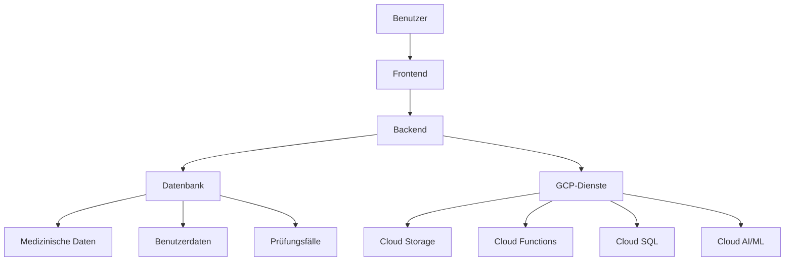

# Architektur des Mentor-Agenten-Systems

## 1. Gesamtarchitektur

### 1.1 Systemübersicht

### 1.2 Frontend-Architektur

**Technologien:**
- React.js (Framework)
- TypeScript
- Material-UI (UI-Bibliothek)
- Responsive Design mit CSS Grid/Flexbox

**Komponenten:**
- Benutzeroberfläche für Interaktion mit dem Mentor-Agenten
- Such- und Abfragekomponenten
- Interaktive Lernmodule und Quizfragen
- Dokumentations- und Speicherungsfunktionen

### 1.3 Backend-Architektur

**Technologien:**
- Node.js mit Express.js
- RESTful API
- Authentication: JWT (JSON Web Tokens)
- Authorization: Role-Based Access Control (RBAC)

**Module:**
- Benutzerverwaltung
- Inhaltsverwaltung
- Spaced Repetition Algorithmus
- Such- und Abfragemodul
- Dokumentationsmodul

### 1.4 Datenbank-Architektur

**Technologien:**
- PostgreSQL (relationale Datenbank)
- MongoDB (für unstrukturierte medizinische Daten)

**Datenmodelle:**
- Benutzer (User)
- Medizinische Inhalte (MedicalContent)
- Prüfungsfälle (ExamCase)
- Dokumentation (Documentation)
- Lernfortschritt (LearningProgress)

## 2. Spezifische Module und Komponenten

### 2.1 Spaced Repetition Algorithmus

**Funktionen:**
- Berechnung der optimalen Wiederholungsintervalle
- Anpassung der Intervalle basierend auf Benutzerfeedback
- Integration mit dem Lernfortschrittsmodul

**Technische Umsetzung:**
- Implementierung des SM-2 Algorithmus
- Speicherung der Wiederholungsintervalle in der Datenbank
- API-Endpunkte für die Interaktion mit dem Frontend

### 2.2 Benutzerverwaltung

**Funktionen:**
- Registrierung und Anmeldung
- Profilverwaltung
- Rollen- und Berechtigungsmanagement

**Technische Umsetzung:**
- JWT-basierte Authentifizierung
- RBAC für Autorisierung
- API-Endpunkte für Benutzeroperationen

### 2.3 Inhaltsverwaltung

**Funktionen:**
- Verwaltung medizinischer Inhalte
- Kategorisierung und Tagging
- Versionierung und Aktualisierung

**Technische Umsetzung:**
- Datenbankmodelle für medizinische Inhalte
- API-Endpunkte für Content-Operationen
- Integration mit GCP Cloud Storage für Dateispeicherung

### 2.4 Such- und Abfragemodul

**Funktionen:**
- Volltextsuche in medizinischen Dokumenten
- Filterung und Sortierung von Suchergebnissen
- Integration mit externen APIs für medizinische Daten

**Technische Umsetzung:**
- Elasticsearch für Volltextsuche
- API-Endpunkte für Suchanfragen
- Integration mit GCP Cloud Functions für Datenverarbeitung

### 2.5 Dokumentationsmodul

**Funktionen:**
- Dokumentation und Speicherung von Prüfungsfällen
- Export von Dokumenten in verschiedenen Formaten
- Import von medizinischen Daten und Dokumenten

**Technische Umsetzung:**
- Datenbankmodelle für Dokumentation
- API-Endpunkte für Dokumentationsoperationen
- Integration mit GCP Cloud Storage für Dateispeicherung

## 3. Integration der Materialien und Datenquellen

### 3.1 Prüfungsablauf-Dokumentation

**Integration:**
- Import der Markdown-Dateien in die Datenbank
- Parsing und Strukturierung der Inhalte
- Bereitstellung über API-Endpunkte

### 3.2 Faktencheck-Quellen

**Integration:**
- Import der Leitlinien und Fachinformationen
- Strukturierung und Kategorisierung der Inhalte
- Bereitstellung über API-Endpunkte

### 3.3 Bibliothek

**Integration:**
- Import des Leitlinien-Manifests
- Bereitstellung der Leitlinien über API-Endpunkte
- Integration mit GCP Cloud Storage für Dateispeicherung

## 4. Technische Anforderungen und GCP-Integration

### 4.1 GCP-Dienste

**Cloud Storage:**
- Speicherung von medizinischen Daten, Dokumenten und Bildern
- Integration mit dem Backend für Dateioperationen

**Cloud Functions:**
- Serverlose Ausführung von Funktionen für die Verarbeitung von medizinischen Daten
- Integration mit dem Backend für Datenverarbeitung

**Cloud SQL:**
- Verwaltung von relationalen Datenbanken für medizinische Daten und Benutzerinformationen
- Integration mit dem Backend für Datenbankoperationen

**Cloud AI und Machine Learning:**
- Integration von KI- und ML-Diensten für die Verarbeitung und Analyse von medizinischen Daten
- Nutzung von GCP-AI-APIs für die Verarbeitung von medizinischen Daten

### 4.2 Kostenoptimierung

**Maßnahmen:**
- Nutzung des $850 Guthabens für die Einrichtung und den Betrieb der Anwendung
- Optimierung der Kosten durch Nutzung von GCP-Kostenmanagement-Tools
- Überwachung und Verwaltung der Kosten durch Nutzung von GCP-Budget- und Alert-Tools

### 4.3 Sicherheit und Compliance

**Maßnahmen:**
- Nutzung von GCP Security- und Compliance-Diensten für den Schutz von sensiblen Daten
- Implementierung von Datenschutz- und Sicherheitsrichtlinien
- Regelmäßige Überprüfung und Aktualisierung der Sicherheitsmaßnahmen

## 5. Zusammenfassung

Die Architektur des Mentor-Agenten-Systems umfasst eine klare Trennung von Frontend, Backend und Datenbank. Die spezifischen Module und Komponenten sind auf die Anforderungen der medizinischen Prüfungsvorbereitung zugeschnitten und nutzen die identifizierten Materialien und Datenquellen. Die Integration mit der Google Cloud Platform (GCP) ermöglicht eine skalierbare und kosteneffiziente Umsetzung des Systems.
